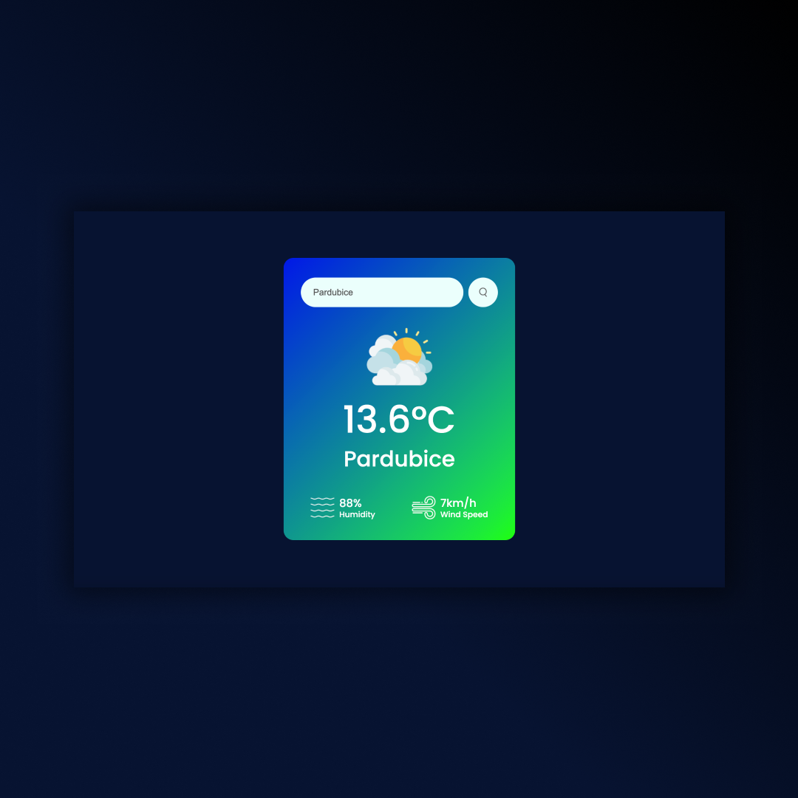
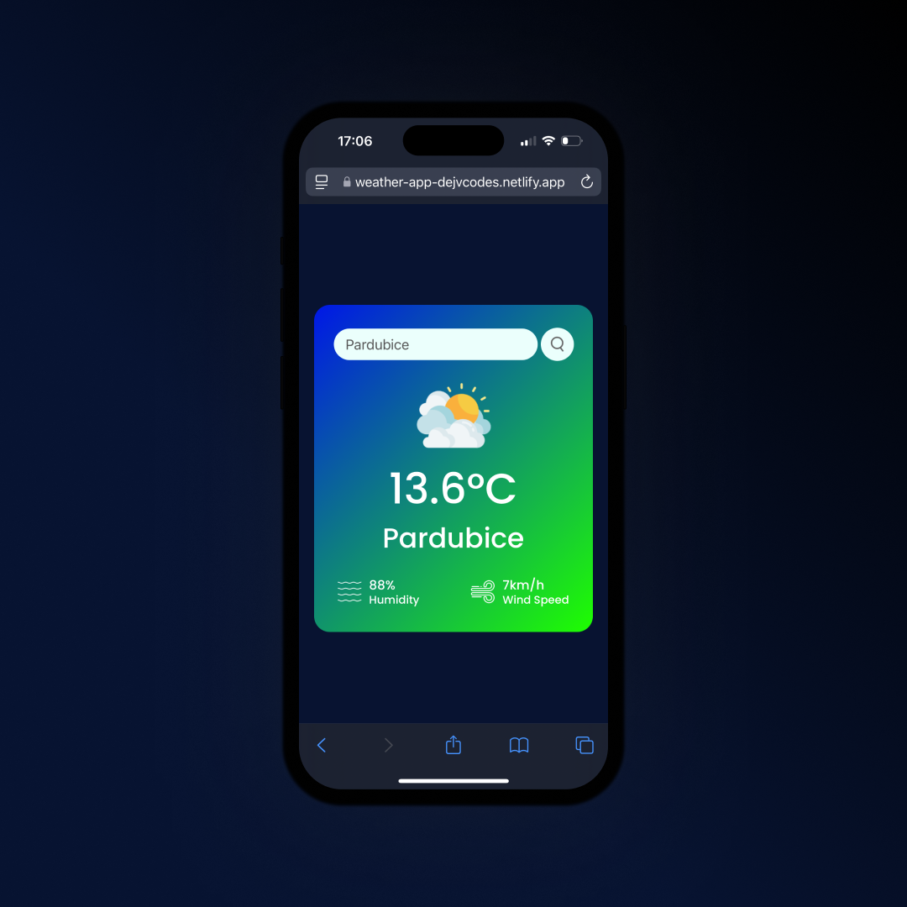

## Weather App
• HTML, CSS & JavaScript  
• Current weather data from API key from OpenWeatherMap  
• We will display the weather info on website from Free API using JavaScript.  
• Responsive Design 

## Screenshots 📱
 

## 💻 Tech Stack

## 🌐 Link
<a href="https://weather-app-dejvcodes.netlify.app/">Weather App</a>

## License🔐
[MIT License](LICENSE)
